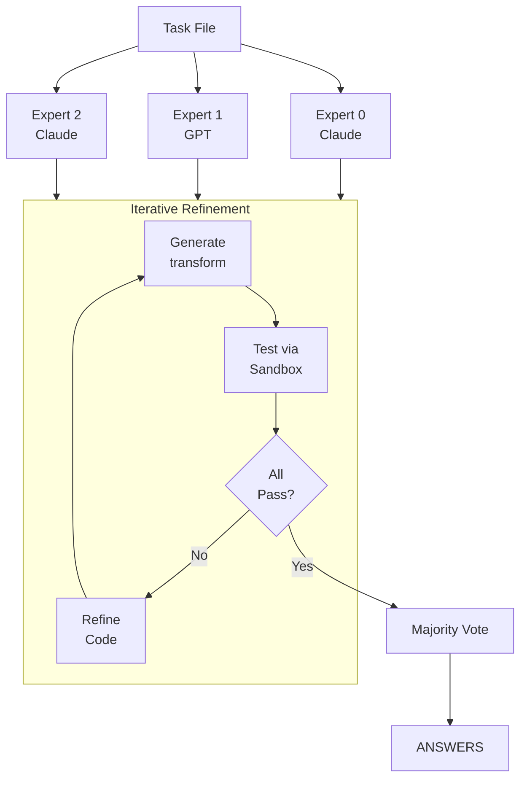

# ARC-AGI Solver

Solve [ARC-AGI-2](https://github.com/arcprize/ARC-AGI-2) tasks using iterative code synthesis with parallel experts and majority voting.

Based on [Poetiq's ARC-AGI solver](https://github.com/poetiq-ai/poetiq-arc-agi-solver).

## Installation

```bash
amplifier bundle add git+https://github.com/DavidKoleczek/amplifier-expert-cookbook@main#subdirectory=arc-agi-solver
amplifier bundle use arc-agi-solver
```

## How It Works



Each expert independently:
1. Analyzes training examples
2. Generates `transform()` code
3. Tests against training data via sandbox
4. Receives detailed feedback (pixel diffs, accuracy)
5. Refines until all examples pass

Final answers selected by consensus voting across experts.

## Context Variables

| Variable | Required | Default | Description |
|----------|----------|---------|-------------|
| `task_file` | Yes | - | Path to ARC task file (markdown or JSON) |
| `working_dir` | No | `./arc_output` | Directory for outputs |
| `max_iterations` | No | `10` | Max refinement attempts per expert |

## Task File Format

Markdown format:
```markdown
## Training Examples

### Example 1
Input:
[[0, 1, 2], [3, 4, 5]]
Output:
[[5, 4, 3], [2, 1, 0]]

## Test Input(s)

### Test 0
Input:
[[1, 2, 3], [4, 5, 6]]
```

Or standard ARC JSON format.

## Output Structure

```
working_dir/
├── experts/
│   ├── expert_0_code.py
│   ├── expert_0_results.json
│   ├── expert_1_code.py
│   ├── expert_1_results.json
│   ├── expert_2_code.py
│   └── expert_2_results.json
└── results/
    ├── ANSWER_0.json
    └── ANSWER_1.json
```

## Sandbox Script

The `scripts/sandbox.py` can be used standalone:

```bash
uv run scripts/sandbox.py \
  --code-file=my_transform.py \
  --task-file=examples/sample-task.txt \
  --output=text
```

## Note on Subdirectory Bundles

For subdirectory bundles, use the root bundle namespace with the full path:

```
@amplifier-expert-cookbook:arc-agi-solver/recipes/arc-solver.yaml
```
